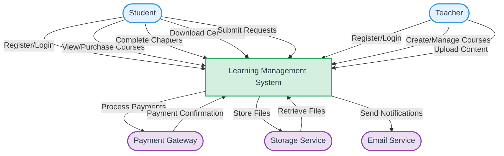
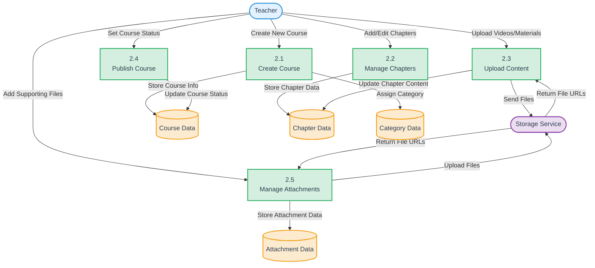
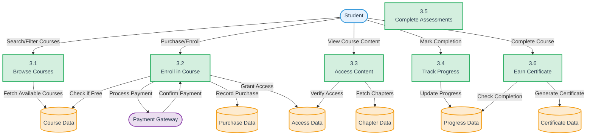
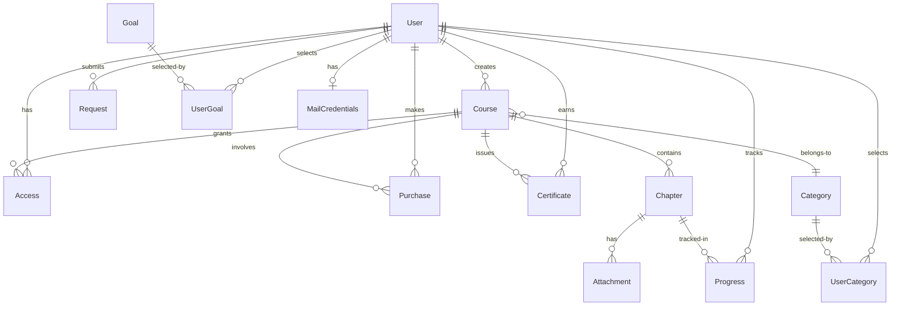

# Learning Management System (LMS) - Data Flow Diagram

## Level 0 DFD (Context Diagram)

## Level 1 DFD 

```mermaid
flowchart TD
    %% Define styles for better printing
    classDef entity fill:#e4f1fe,stroke:#3498db,stroke-width:2px,color:#2c3e50
    classDef process fill:#d4efdf,stroke:#27ae60,stroke-width:2px,color:#2c3e50
    classDef store fill:#fdebd0,stroke:#f39c12,stroke-width:2px,color:#2c3e50
    classDef external fill:#ebdef0,stroke:#8e44ad,stroke-width:2px,color:#2c3e50
    
    %% External Entities
    Student([Student]):::entity
    Teacher([Teacher]):::entity
    Payment([Payment Gateway]):::external
    Storage([Storage Service]):::external
    Email([Email Service]):::external
    
    %% Processes
    Auth[1.0<br>Authentication]:::process
    CourseManagement[2.0<br>Course Management]:::process
    ContentDelivery[3.0<br>Content Delivery]:::process
    UserManagement[4.0<br>User Management]:::process
    PaymentProcessing[5.0<br>Payment Processing]:::process
    ProgressTracking[6.0<br>Progress Tracking]:::process
    CertificateGeneration[7.0<br>Certificate Generation]:::process
    
    %% Data Stores
    UserStore[(User Data)]:::store
    CourseStore[(Course Data)]:::store
    ChapterStore[(Chapter Data)]:::store
    ProgressStore[(Progress Data)]:::store
    PurchaseStore[(Purchase Data)]:::store
    CategoryStore[(Category Data)]:::store
    RequestStore[(Request Data)]:::store
    CertificateStore[(Certificate Data)]:::store
    
    %% Authentication flows
    Student -->|Login/Register| Auth
    Teacher -->|Login/Register| Auth
    Auth -->|Store User Data| UserStore
    Auth -->|Verify User| UserStore
    
    %% Course Management flows
    Teacher -->|Create/Edit Courses| CourseManagement
    CourseManagement -->|Store Course Data| CourseStore
    CourseManagement -->|Upload Files| Storage
    Storage -->|File URLs| CourseManagement
    CourseManagement -->|Store Categories| CategoryStore
    
    %% Content Delivery flows 
    Student -->|Browse Courses| ContentDelivery
    ContentDelivery -->|Fetch Courses| CourseStore
    ContentDelivery -->|Fetch Chapters| ChapterStore
    ContentDelivery -->|Fetch Categories| CategoryStore
    ContentDelivery -->|Stream Content| Student
    ContentDelivery -->|Download Materials| Student
    
    %% User Management flows
    Student -->|Update Profile| UserManagement
    Teacher -->|Update Profile| UserManagement
    UserManagement -->|Store User Data| UserStore
    Student -->|Submit Requests| UserManagement
    UserManagement -->|Store Requests| RequestStore
    
    %% Payment flows
    Student -->|Purchase Course| PaymentProcessing
    PaymentProcessing -->|Process Payment| Payment
    Payment -->|Payment Status| PaymentProcessing
    PaymentProcessing -->|Store Purchase| PurchaseStore
    PaymentProcessing -->|Grant Access| CourseStore
    
    %% Progress flows
    Student -->|Complete Chapters| ProgressTracking
    ProgressTracking -->|Update Progress| ProgressStore
    ProgressTracking -->|Check Completion| ChapterStore
    
    %% Certificate flows
    Student -->|Request Certificate| CertificateGeneration
    CertificateGeneration -->|Check Eligibility| ProgressStore
    CertificateGeneration -->|Generate Certificate| CertificateStore
    CertificateGeneration -->|Send Certificate| Email
    CertificateGeneration -->|Download Certificate| Student
    
    %% Define diagram title and caption
    subgraph DFD1[" "]
        direction TB
        style DFD1 fill:none,stroke:none
    end
```

## Level 2 DFD - Course Management Process

## Level 2 DFD - Student Learning Process

## Database Schema Relationships

## Data Dictionary

### External Entities
- **Student**: End-user who consumes course content and earns certificates
- **Teacher**: Content creator who develops and manages courses
- **Payment Gateway**: External service for processing payments (Razorpay)
- **Storage Service**: External service for storing files (UploadThing)
- **Email Service**: External service for sending notifications (Resend/Nodemailer)

### Processes
- **Authentication**: Manages user login, registration, and verification
- **Course Management**: Handles course creation, editing, and publishing
- **Content Delivery**: Serves course content to students
- **User Management**: Manages user profiles and requests
- **Payment Processing**: Handles course purchases and payment verification
- **Progress Tracking**: Tracks student progress through courses
- **Certificate Generation**: Creates and distributes course completion certificates

### Data Stores
- **User Data**: Information about students and teachers
- **Course Data**: Course details including title, description, and pricing
- **Chapter Data**: Content modules within courses
- **Progress Data**: Student completion status for chapters
- **Purchase Data**: Records of course purchases
- **Category Data**: Course categories for organization
- **Request Data**: Student support requests
- **Certificate Data**: Course completion certificates 