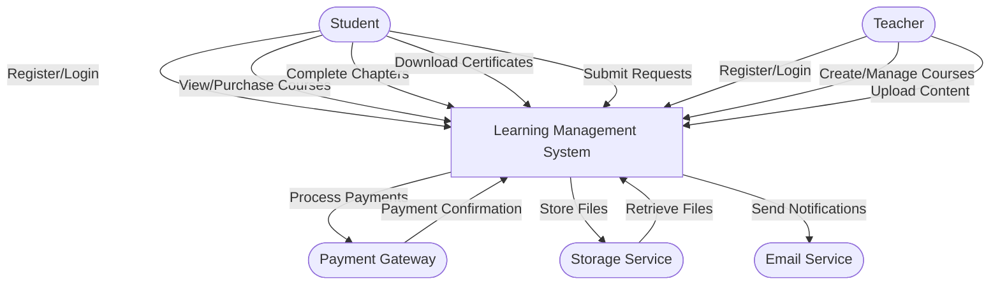
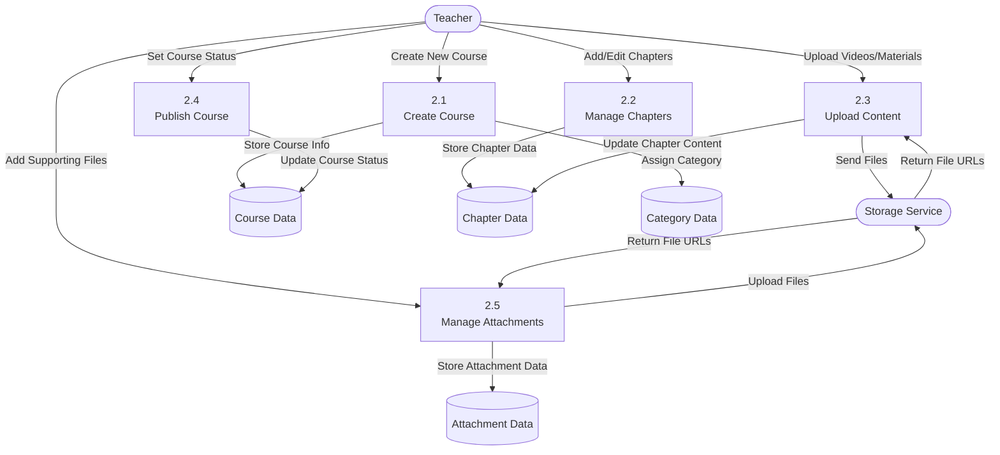
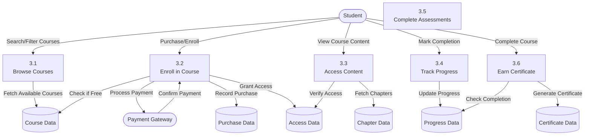
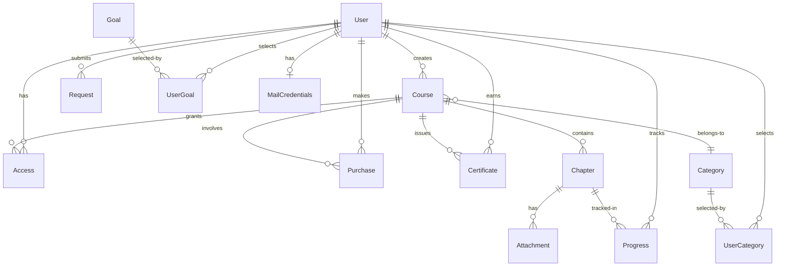

# Learning Management System (LMS) - Data Flow Diagram

## Level 0 DFD (Context Diagram)

## Level 1 DFD

```mermaid
flowchart TD
    %% External Entities
    Student([Student])
    Teacher([Teacher])
    Payment([Payment Gateway])
    Storage([Storage Service])
    Email([Email Service])
    
    %% Processes
    Auth[1.0\nAuthentication]
    CourseManagement[2.0\nCourse Management]
    ContentDelivery[3.0\nContent Delivery]
    UserManagement[4.0\nUser Management]
    PaymentProcessing[5.0\nPayment Processing]
    ProgressTracking[6.0\nProgress Tracking]
    CertificateGeneration[7.0\nCertificate Generation]
    
    %% Data Stores
    UserStore[(User Data)]
    CourseStore[(Course Data)]
    ChapterStore[(Chapter Data)]
    ProgressStore[(Progress Data)]
    PurchaseStore[(Purchase Data)]
    CategoryStore[(Category Data)]
    RequestStore[(Request Data)]
    CertificateStore[(Certificate Data)]
    
    %% Flows - Authentication
    Student -->|Login/Register| Auth
    Teacher -->|Login/Register| Auth
    Auth -->|Store User Data| UserStore
    Auth -->|Verify User| UserStore
    
    %% Flows - Course Management
    Teacher -->|Create/Edit Courses| CourseManagement
    CourseManagement -->|Store Course Data| CourseStore
    CourseManagement -->|Upload Files| Storage
    Storage -->|File URLs| CourseManagement
    CourseManagement -->|Store Categories| CategoryStore
    
    %% Flows - Content Delivery
    Student -->|Browse Courses| ContentDelivery
    ContentDelivery -->|Fetch Courses| CourseStore
    ContentDelivery -->|Fetch Chapters| ChapterStore
    ContentDelivery -->|Fetch Categories| CategoryStore
    ContentDelivery -->|Stream Content| Student
    ContentDelivery -->|Download Materials| Student
    
    %% Flows - User Management
    Student -->|Update Profile| UserManagement
    Teacher -->|Update Profile| UserManagement
    UserManagement -->|Store User Data| UserStore
    Student -->|Submit Requests| UserManagement
    UserManagement -->|Store Requests| RequestStore
    
    %% Flows - Payment Processing
    Student -->|Purchase Course| PaymentProcessing
    PaymentProcessing -->|Process Payment| Payment
    Payment -->|Payment Status| PaymentProcessing
    PaymentProcessing -->|Store Purchase| PurchaseStore
    PaymentProcessing -->|Grant Access| CourseStore
    
    %% Flows - Progress Tracking
    Student -->|Complete Chapters| ProgressTracking
    ProgressTracking -->|Update Progress| ProgressStore
    ProgressTracking -->|Check Completion| ChapterStore
    
    %% Flows - Certificate Generation
    Student -->|Request Certificate| CertificateGeneration
    CertificateGeneration -->|Check Eligibility| ProgressStore
    CertificateGeneration -->|Generate Certificate| CertificateStore
    CertificateGeneration -->|Send Certificate| Email
    CertificateGeneration -->|Download Certificate| Student
```

## Level 2 DFD - Course Management Process

## Level 2 DFD - Student Learning Process

## Database Schema Relationships

